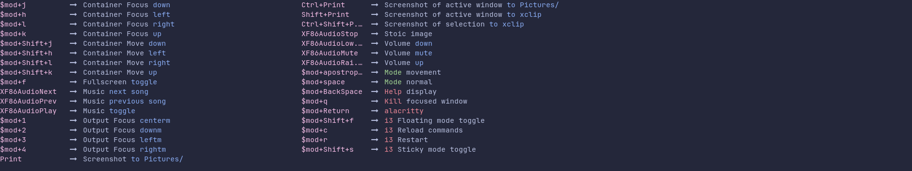

# HEDO

A small sidebar for helping i3 command discovery in i3wm-based linux systems.

## Installation

#### Dependencies

- [ ] python3.11 or higher
- [ ] [rich](https://rich.readthedocs.io/en/stable/)
- [ ] i3

## Quickstart

1. Download the git repo.
2. Configure as described in [usage](#Usage)
3. Run it from the repo basedir (i.e. where the `main.py` file lives): `python3 main.py`


## Usage

i3 does not support inline commenting. This makes difficult to parse the i3 config file for using it as both config and documentation source.

In order to achive this, HEDO assumes some basic syntax differences from the original i3 syntax:

1. All 'modes' (except for default, since it is not explicitly defined) should be declared with a previous '# bindsym##<mode>' comment, exactly in the preceeding line to the mode declaration. 

2. All bindsym should be preceeded by the description comment, that describes the command that is binded to that key/combination, exactly in the preceeding line to the bindsym declaration.

And that's all!

#### Example

This is a usual and i3-valid configuration:
```
set $hedo "alacritty --class 'hedo' -e bash -i -c 'python3 ~/development/hedo/main.py'"

for_window [class="hedo"] floating enable
for_window [class="hedo"] sticky enable
for_window [class="hedo"] resize set 1879 355, move position 20 1170
for_window [class="hedo"] focused
for_window [class="hedo"] move window to output $leftm

bindsym $mod+space mode "normal"

bindsym $mod+BackSpace exec --no-startup-id $hedo; mode "default"

bindsym $mod+f fullscreen toggle; mode "default"

mode "normal" {
    bindsym F1 mode "shutdown"

    bindsym F2 mode "timer"

    bindsym apostrophe mode "movement"
    
    bindsym a mode "audio"

    bindsym Escape mode "default"
}
```

Now, this is the same i3-valid, HEDO-expected configuration:
```
set $hedo "alacritty --class 'hedo' -e bash -i -c 'python3 ~/development/hedo/main.py'"

for_window [class="hedo"] floating enable
for_window [class="hedo"] sticky enable
for_window [class="hedo"] resize set 1879 355, move position 20 1170
for_window [class="hedo"] focused
for_window [class="hedo"] move window to output $leftm

#desc:[green]Mode[/green] normal
bindsym $mod+space mode "normal"

#desc: [red]Help[/red] display
bindsym $mod+BackSpace exec --no-startup-id $hedo; mode "default"

#desc: Fullscreen [blue]toggle[/blue]
bindsym $mod+f fullscreen toggle; mode "default"

# bindsym##normal
mode "normal" {
    #desc:[green]Mode[/green] shutdown
    bindsym F1 mode "shutdown"

    #desc:[green]Mode[/green] timer
    bindsym F2 mode "timer"

    #desc:[green]Mode[/green] movement
    bindsym apostrophe mode "movement"
    
    #desc:[green]Mode[/green] audio
    bindsym a mode "audio"

    #desc: 󱞱 [red]Mode[/red] default
    bindsym Escape mode "default"
}

```
As you might see, other than the comments, no further changes are required.

By this configuration, I can see the HEDO sidebar in the `$leftm` output using my alacritty terminal.

Visit the [rich](https://rich.readthedocs.io/en/stable/) documentation to see how you can display colors and other features (e.g. the `[red]` flags on the config file).

The `~/development/hedo/` is the path to the hedo repository.


### Screenshots


